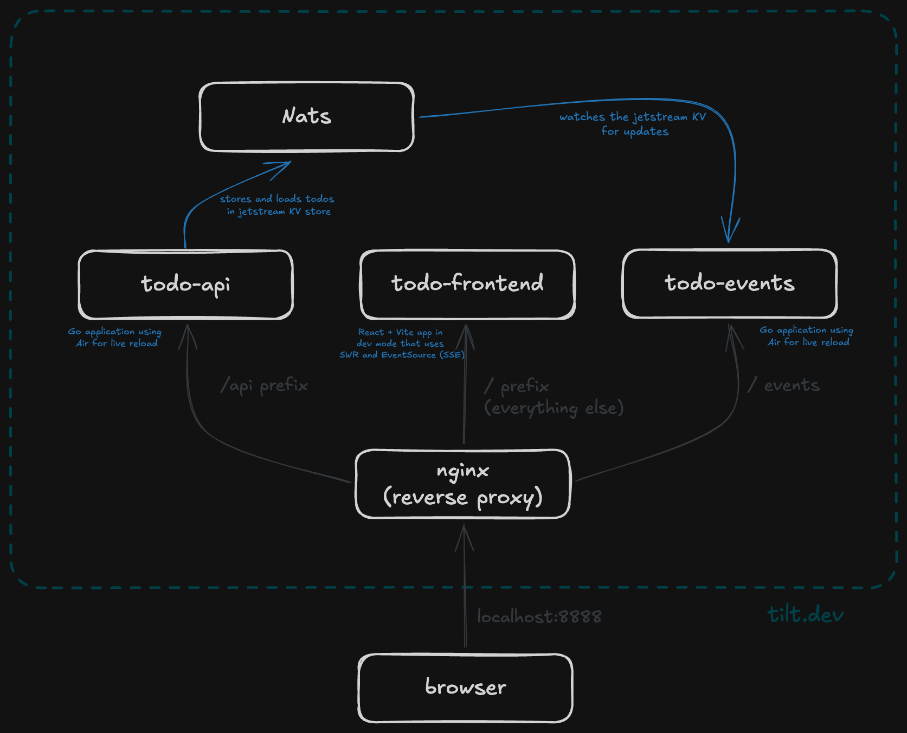

# exploring-tilt

Playing with tilt.dev by building out a small (over engineered) todo-app.

## Prerequisites

- docker / [orbstack](https://orbstack.dev/)
- [tilt](https://tilt.dev/)

## Getting started

```console
tilt up
```

then visit: `http://localhost:8888`

## Architecture diagram



## License

[MIT](./LICENSE)
